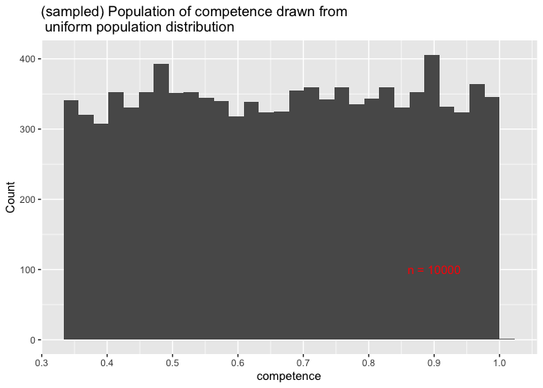
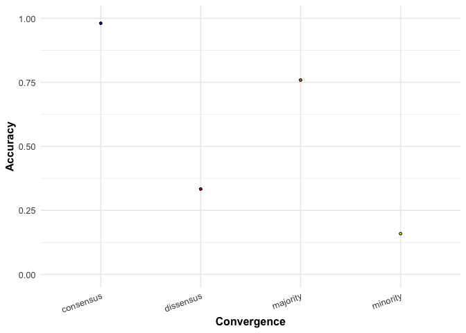
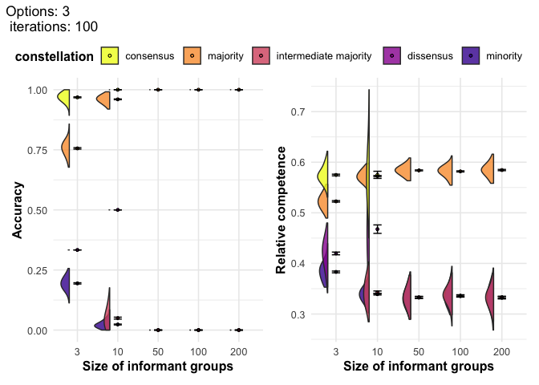
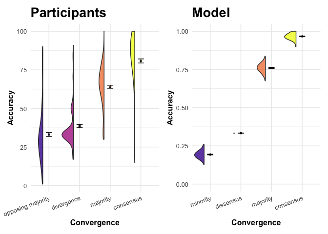
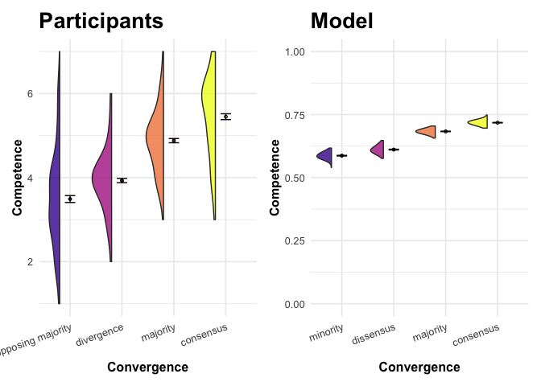

## Load packages

```r
library(tidyverse)
```

```
## ── Attaching core tidyverse packages ──────────────────────── tidyverse 2.0.0 ──
## ✔ dplyr     1.1.1     ✔ readr     2.1.4
## ✔ forcats   1.0.0     ✔ stringr   1.5.0
## ✔ ggplot2   3.4.2     ✔ tibble    3.2.1
## ✔ lubridate 1.9.2     ✔ tidyr     1.3.0
## ✔ purrr     1.0.1     
## ── Conflicts ────────────────────────────────────────── tidyverse_conflicts() ──
## ✖ dplyr::filter() masks stats::filter()
## ✖ dplyr::lag()    masks stats::lag()
## ℹ Use the conflicted package (<http://conflicted.r-lib.org/>) to force all conflicts to become errors
```

```r
library(gghalves) # for plots
library(patchwork)
```

## Set plot theme

```r
#set general theme for plots
plot_theme <- theme_minimal(base_size = 12) +
  theme(# Bold, bigger title
        plot.title = element_text(face = "bold", size = rel(1.7)),
        # Plain, slightly bigger subtitle that is grey
        plot.subtitle = element_text(face = "plain", size = rel(1.3), color = "grey70"),
        # Bold legend titles
        legend.title = element_text(face = "bold"),
        # Bold axis titles
        axis.title = element_text(face = "bold"))
```

## Explaining the model

### Define competence and its distribution 

We define competence simply as the probability of making an accurate choice (among various options). We assume that individuals (i) vary in competence,(ii) that competence is continuous and ranges from pure chance (`1/options`) to certainly making the correct choice (`1`), and that it is distributed uniformly in the population. 


```r
# Imagine a situation with 3 choice options
options <- 3
# generate a uniform competence distribution for a population of n = 10'000
population <- 10000
competence = runif(population, min = 1/options, max = 1)

# data generating function
ggplot() +
  stat_function(fun = dunif, args = list(min = 0, max = 1)) +
  labs(title = "Uniform distribution of competence from 1/3 to 1", x = "Competence", y = "P(Competence)") + 
  xlim(1/3, 1)
```

<!-- -->

```r
# generated population
ggplot() +
  geom_histogram(aes(x = competence)) + 
  scale_x_continuous(breaks = seq(from = 0, to = 1, by = 0.1)) + 
  annotate("text", x = 0.9, y = 100, label = paste0("n = ", population), color = "red") +
  labs(title = "(sampled) Population of competence drawn from \n uniform population distribution", 
       y = "Count")
```

```
## `stat_bin()` using `bins = 30`. Pick better value with `binwidth`.
```

<!-- -->
### Generate choices from competence

### Sample choice

### Iterate this process

## Function for single population


```r
simulate_single_population <- function(population, sample, options, 
                                       distribution = "uniform") {
  # Check if population is not divisible by sample without remainder
  if (population %% sample != 0) {
    warning("Population is not divisible by sample without remainder.")
  }
  
  # if necessary, alter population size so that it is divisible by sample without rest
  n_possible_samples <- floor(population/sample)
  
  # Biggest possible population to pick
  possible_population = n_possible_samples * sample
  
  # Issue warning if different population size used
  if (population %% sample != 0) {
    warning(paste0("Chosen population size is ", possible_population))
  }
  # change population value (if divisible without remainder, it'll be the same)
  population = possible_population
  
  # 1: Distribution of competence
  
  if (distribution == "uniform") {
  # randomly draw competence levels
  data <- tibble(id = 1:population,
                 competence = runif(population, min = 1/options, max = 1))
  }
  
  if (distribution == "normal") {
  # randomly draw competence levels
  data <- tibble(id = 1:population,
                 competence = rnorm(population, mean = 0.6, sd = 0.01))
  }
  
  # Create a relative measure of competence that allows to compare across
  # different numbers of choice options. 
  # This measure varies from 0 = random chance to 1 = definitely right. 
  # We use min-max scaling, with min = 1/options and max = 1.
  data <- data %>% 
    mutate(relative_competence = (competence - 1/options) / (1 - 1/options)
           )
  
  # 2: randomly draw individual answers based on competence levels 
  data$answer <- data$competence %>% 
    purrr::map_chr(function(x){ 
      
      answer_options <- c("correct", paste0("false", 1:(options-1)))
      probabilities <- c(x, rep((1-x)/(options-1), options-1))
      
      answer = sample(answer_options, 
                      size = 1, 
                      prob = probabilities
      )
      return(answer)
      
    }) 
  
  # 3: randomly assign samples in population
  data <- data %>% mutate(sample_id = rep(1:(population/sample), sample))
  
  # 4: identify constellations 
  data <- data %>% 
    # identify how often a one type of answer occurs in one group
    group_by(sample_id, answer) %>% 
  mutate(n_answer_in_sample = n()) %>% 
    # assign constellations
  group_by(sample_id) %>% 
    mutate(unique_answers = n_distinct(answer),
           # Build a first version of constellation variable
           constellation = case_when(unique_answers == sample ~ "dissensus", 
                                     unique_answers == 1 ~ "consensus",
                                     unique_answers <  sample ~ "majority"
           ),
           # identify minority answers in majority constellations
           minority = ifelse(constellation == "majority", 
                             # report whether occurences of answer within a group
                             # are the minority within that group
                             n_answer_in_sample == min(n_answer_in_sample),
                             # for all other constellations, simply code NA,
                             NA
           ), 
           # identify majority answers in majority constellations
           majority = ifelse(constellation == "majority", 
                             # report whether occurrences of answer within a group
                             # are the majority within that group
                             n_answer_in_sample == max(n_answer_in_sample),
                             # for all other constellations, simply code NA,
                             NA
           ), 
           # modify the constellation variable to distinguish between minority, 
           # intermediate majority, majority and dissensus that is composed of 
           # multiple answers (e.g. 3 options, sample of 6, two per option)
           constellation = case_when(
             is.na(minority) | is.na(majority) ~ constellation, 
             minority == TRUE & majority == TRUE ~ "dissensus",
             minority == TRUE ~ "minority", 
             majority == TRUE ~ "majority", 
             .default = "intermediate majority")
           ) %>% ungroup()
  
  # 5: calculate accuracy and competence levels per constellation
  
  # identify accurate responses
  data <- data %>%
    mutate(accurate = ifelse(answer == "correct", TRUE, FALSE))
  
  # compute the summary statistics by constellation
  results <- data %>% 
    group_by(constellation) %>% 
    summarize(average_competence = mean(competence), 
              average_relative_competence = mean(relative_competence),
              average_accuracy = mean(accurate),
              count = n_distinct(sample_id)) %>% 
    # store simulation information
    mutate(population = population, 
           sample = sample, 
           options = options)
  
  return(results)
}
```


```r
# # test output (set return to data above)
# test <- simulate_single_population(population = 600, sample = 6, options = 3) %>% arrange(sample_id)
# levels(as.factor(test$constellation))
# 
# test %>% filter(constellation == "intermediate majority")
```

## Function for various populations

```r
simulate_various_populations <- function(iterations,...) {
  
  # create data frame with model results for generated samples
  various_populations <- 1:iterations %>% 
    purrr::map_df(function(x){
      # this is essentially a for loop - do the following for each 
      # element in 1:iterations
      
      results <- simulate_single_population(...)
      
      # identify iteration
      results$iteration <- x
      
      # To keep track of progress
      if (x %% 50 == 0) {print(paste("iteration number ", x))}
      
      return(results)
      
    }) %>% 
    # store simulation information
    mutate(total_iterations = iterations)
  
  return(various_populations)
}
```


## Function for varying choice options and sample size function

This function allows us to investigate how accuracy and competence change with varying the number of choice options and the sample size. 

The simulations that this function executes will take quite some time. Therefore, we do not want to run it every time we render this document. Instead we want to store the output of the power simulation in a `.csv` file, and have an integrated "stop" mechanism to prevent execution when that file already exists. To achieve this, we make `file_name` a mandatory argument. If a file with that name already exists, the function will not be executed.


```r
# set name
file_name <- "model.csv" # change for new analyses / or delete file to re-use same name

vary_sample_options <- function(vary = "options", file_name, n, ...) {
  
  # only run analysis if a file with that name does not yet exists
  if (!file.exists(paste0("data/", file_name))) {
    
    
    # vary choice options for given sample size
    if (vary == "options") {
      
      # do the `calculate_power()` function for each sample size and store the results
      # in a new variable called `power`
      data <- n %>% purrr::map_df(function(n_option){
                                     # this is essentially a for loop - 
                                     # do the following for each 
                                     # element data$n_subj
                                     
                                     # To keep track of progress
                                     print(paste("tested option number = ", n_option))
                                     
                                     # run power calculation
                                     result <- simulate_various_populations(
                                       options = n_option, ...)
                                     
                                     return(result)
                                     
                                   })
      
      write_csv(data, paste0("data/", file_name))
    }
    
    # vary sample size for given choice option
     if (vary == "sample") {
      
      # do the `calculate_power()` function for each sample size and store the results
      # in a new variable called `power`
      data <- n %>% purrr::map_df(function(n_sample){
                                     # this is essentially a for loop - 
                                     # do the following for each 
                                     # element data$n_subj
                                     
                                     # To keep track of progress
                                     print(paste("tested sample number = ", n_sample))
                                     
                                     # run power calculation
                                     result <- simulate_various_populations(
                                       sample = n_sample, ...)
                                     
                                     return(result)
                                     
                                   })
      
      write_csv(data, paste0("data/", file_name))
    }
  }
}

# # You can test the function using the commented code below
# # (un-comment by highlighting, then command+shit+c)
# test <- do.call(power_by_sample_size,
#                 c(parameters,
#                   list(file_name = file_name, sample_sizes = c(5, 10),
#                        iterations = 100)
#                   )
#                 )
```

## Plot functions

### a) Plot various populations

First, we want a function that plots results obtained by the `simulate_various_populations` function. 

```r
plot_results <- function(data, outcome = "everything") {
  
  d <- data
  
  # make constellation a factor with the right levels
  d$constellation <- fct_relevel(d$constellation, "minority", "dissensus", "intermediate majority", "majority", "consensus")
  
  # extract simulation info
  simulation_info <- d %>% summarize(across(c(population, sample, options, total_iterations), mean)) %>% 
    pivot_longer(everything(), names_to = "parameter", values_to = "value") %>% 
    gridExtra::tableGrob(cols = NULL, rows = NULL)
  
  # make descriptive data
  descriptive <- d %>% 
    group_by(constellation) %>% 
    summarise(count = sum(count)) %>% 
    mutate(rel_freq = round(count / sum(count), digits = 2)) %>% 
    gridExtra::tableGrob(rows = NULL)

  
  # plot for accuracy
  plot_accuracy <- ggplot(d,
                          aes(x = constellation, y = average_accuracy, fill = constellation)) +
    geom_half_violin(position = position_nudge(x = -.2),
                     adjust=2, alpha = .8,
                     side = "l") +
    stat_summary(fun = "mean", geom = "point", size = 1, shape = 21) +
    stat_summary(fun = "mean", geom = "line", size = 1, linetype = "dashed") +
    stat_summary(fun.data = "mean_se", geom = "errorbar", width = .2) +
    # Add nice labels
    labs(x = "Convergence", y = "Accuracy") +
    scale_fill_viridis_d(option = "plasma", begin = 0.1) +
    guides(fill = FALSE) +
    plot_theme + 
    theme(axis.text.x = element_text(angle = 20, hjust = 1)) +
    ylim(c(0, 1))
  
  # plot for competence
  plot_competence <- ggplot(d,
                            aes(x = constellation, y = average_competence, fill = constellation)) +
    geom_half_violin(position = position_nudge(x = -.2),
                     adjust=2, alpha = .8,
                     side = "l") +
    stat_summary(fun = "mean", geom = "point", size = 1, shape = 21) +
    stat_summary(fun = "mean", geom = "line", size = 1, linetype = "dashed") +
    stat_summary(fun.data = "mean_se", geom = "errorbar", width = .2) +
    # Add nice labels
    labs(x = "Convergence", y = "Competence") +
    scale_fill_viridis_d(option = "plasma", begin = 0.1) +
    guides(fill = FALSE) +
    plot_theme + 
    theme(axis.text.x = element_text(angle = 20, hjust = 1)) +
    ylim(c(0, 1))
  
  # unite tables
  tables <- gridExtra::grid.arrange(descriptive, simulation_info, ncol = 2)
  
  if (outcome == "everything") {
    
    return((plot_accuracy | plot_competence) / tables)
  }
  
  if (outcome == "accuracy") {
    
    return(plot_accuracy)
  }
  
  if (outcome == "competence") {
    
    return(plot_competence)
  }
  
}
```

### b) Plot varying sample options

Second, we want a function that plots results obtained by the `vary_sample_options` function. 


```r
plot_results_vary <- function(data, variable = options) {
  
  d <- data
  
  # Extract variable name as a string
  variable_name <- deparse(substitute(variable))
  
  # retrieve info from choice of variable
  if (variable_name == "options") {
    x_label = "Number of Choice Options"
    title = paste0("Sample: ", d$sample," \n iterations: ", d$total_iterations)
  }
    if (variable_name == "sample") {
    x_label = "Size of informant groups"
    title = paste0("Options: ", d$options," \n iterations: ", d$total_iterations)
  }
  
  # make constellation a factor with the right levels
  d$constellation <- fct_relevel(d$constellation, "minority", "dissensus", "intermediate majority", "majority", "consensus")
  
  # plot for accuracy
  plot_accuracy <- ggplot(d,
                          aes(x = as.factor({{variable}}), y = average_accuracy, fill = constellation)) +
    geom_half_violin(position = position_nudge(x = -.2),
                     adjust=2, alpha = .8,
                     side = "l") +
    stat_summary(fun = "mean", geom = "point", size = 1, shape = 21) +
    stat_summary(fun = "mean", geom = "line", size = 1, linetype = "dashed") +
    stat_summary(fun.data = "mean_se", geom = "errorbar", width = .2) +
    # Add nice labels
    labs(x = x_label, y = "Accuracy") +
    scale_fill_viridis_d(option = "plasma", begin = 0.1, 
                         limits = rev(levels(d$constellation)),
                         direction = -1
    ) +
    plot_theme 
  
  # plot for competence
  plot_competence <- ggplot(d,
                            aes(x = as.factor({{variable}}), y = average_relative_competence, fill = constellation)) +
    geom_half_violin(position = position_nudge(x = -.2),
                     adjust=2, alpha = .8,
                     side = "l") +
    stat_summary(fun = "mean", geom = "point", size = 1, shape = 21) +
    stat_summary(fun = "mean", geom = "line", size = 1, linetype = "dashed") +
    stat_summary(fun.data = "mean_se", geom = "errorbar", width = .2) +
    # Add nice labels
    labs(x = x_label, y = "Relative competence", fill = NULL) + 
    scale_fill_viridis_d(option = "plasma", begin = 0.1, 
                         limits = rev(levels(d$constellation)),
                         direction = -1
    ) +
    plot_theme 
  
  ggpubr::ggarrange(plot_accuracy, plot_competence, common.legend = TRUE) +
    plot_annotation(title = title)
}
```

## Simulate


```r
n <- c(3, 10, 50, 100, 200)

vary_sample_options(n = n, vary = "options", iterations = 100, population = 999, sample = 3, file_name = "model_3_options.csv")
vary_sample_options(n = n, vary = "sample", iterations = 100, population = 999, options = 3, file_name = "model_3_samples.csv")

data_3_options <- read_csv("data/model_3_options.csv")
data_3_sample <- read_csv("data/model_3_samples.csv")

plot_results_vary(data_3_options)
```

```
## Warning: 1 unknown level in `f`: intermediate majority
```

```
## Warning: Using `size` aesthetic for lines was deprecated in ggplot2 3.4.0.
## ℹ Please use `linewidth` instead.
## This warning is displayed once every 8 hours.
## Call `lifecycle::last_lifecycle_warnings()` to see where this warning was
## generated.
```

<!-- -->

```r
plot_results_vary(data_3_sample, variable = sample)
```

<!-- -->


```r
data_3_sample %>% group_by(sample, constellation) %>% summarise(across(c(average_accuracy, average_relative_competence), mean))
```

```
## `summarise()` has grouped output by 'sample'. You can override using the
## `.groups` argument.
```

```
## # A tibble: 18 × 4
## # Groups:   sample [5]
##    sample constellation         average_accuracy average_relative_competence
##     <dbl> <chr>                            <dbl>                       <dbl>
##  1      3 consensus                       0.968                        0.575
##  2      3 dissensus                       0.333                        0.420
##  3      3 majority                        0.756                        0.523
##  4      3 minority                        0.194                        0.383
##  5     10 consensus                       1                            0.575
##  6     10 dissensus                       0.5                          0.468
##  7     10 intermediate majority           0.0497                       0.343
##  8     10 majority                        0.960                        0.573
##  9     10 minority                        0.0232                       0.339
## 10     50 intermediate majority           0                            0.333
## 11     50 majority                        1                            0.584
## 12     50 minority                        0                            0.332
## 13    100 intermediate majority           0                            0.336
## 14    100 majority                        1                            0.582
## 15    100 minority                        0                            0.335
## 16    200 intermediate majority           0                            0.333
## 17    200 majority                        1                            0.585
## 18    200 minority                        0                            0.332
```

```r
# make descriptive data
data_3_sample %>% 
  group_by(sample, constellation) %>% 
  summarise(count = sum(count)) %>% 
  mutate(rel_freq = round(count / sum(count), digits = 2)) %>% 
  print(n = 100)
```

```
## `summarise()` has grouped output by 'sample'. You can override using the
## `.groups` argument.
```

```
## # A tibble: 18 × 4
## # Groups:   sample [5]
##    sample constellation         count rel_freq
##     <dbl> <chr>                 <dbl>    <dbl>
##  1      3 consensus             10188     0.19
##  2      3 dissensus              3616     0.07
##  3      3 majority              19496     0.37
##  4      3 minority              19496     0.37
##  5     10 consensus               154     0.01
##  6     10 dissensus                88     0   
##  7     10 intermediate majority  4461     0.19
##  8     10 majority               9658     0.4 
##  9     10 minority               9658     0.4 
## 10     50 intermediate majority  1698     0.31
## 11     50 majority               1900     0.35
## 12     50 minority               1900     0.35
## 13    100 intermediate majority   835     0.32
## 14    100 majority                900     0.34
## 15    100 minority                900     0.34
## 16    200 intermediate majority   381     0.32
## 17    200 majority                400     0.34
## 18    200 minority                400     0.34
```


## Simulate

Note that in the current state, we cannot vary `sample`. The function needs modification first. The problem is that it gets complicated with more than three informants, in the case of a majority constellation. There might be equal majorities (e.g. 5 informants, three options: 2 agree on 'A', 2 on 'B', one picks 'A'), equal minorities (e.g. 3 agree on 'A', one picks 'B', another picks 'C'), and unequal majorities (e.g. 3 agree on 'A', 2 agree on 'B').

I have to think about it again.


```r
data_3 <- simulate_various_populations(iterations = 100, population = 999, sample = 3, options = 3)
```

```
## [1] "iteration number  50"
## [1] "iteration number  100"
```


```r
data_3 %>% group_by(constellation) %>% summarise(across(c(average_accuracy, average_competence), mean))
```

```
## # A tibble: 4 × 3
##   constellation average_accuracy average_competence
##   <chr>                    <dbl>              <dbl>
## 1 consensus                0.966              0.718
## 2 dissensus                0.333              0.611
## 3 majority                 0.760              0.683
## 4 minority                 0.193              0.587
```


```r
plot_results(data_3)
```

```
## Warning: 1 unknown level in `f`: intermediate majority
```

```
## Warning: The `<scale>` argument of `guides()` cannot be `FALSE`. Use "none" instead as
## of ggplot2 3.3.4.
## This warning is displayed once every 8 hours.
## Call `lifecycle::last_lifecycle_warnings()` to see where this warning was
## generated.
```

<!-- -->

```
## `geom_line()`: Each group consists of only one observation.
## ℹ Do you need to adjust the group aesthetic?
## `geom_line()`: Each group consists of only one observation.
## ℹ Do you need to adjust the group aesthetic?
```

<!-- -->

```r
model_accuracy <- plot_results(data_3, outcome = "accuracy")
```

```
## Warning: 1 unknown level in `f`: intermediate majority
```

<!-- -->

```r
model_competence <- plot_results(data_3, outcome = "competence")
```

```
## Warning: 1 unknown level in `f`: intermediate majority
```

<!-- -->


```r
# # example to check essential parts of the function
# my_strings <- c("apple", "banana", "apple", "banana", "apple")
# 
# bla <- tibble(id = rep(1:5, each = 5), 
#        string = sample(c("apple", "banana"), 25, replace = TRUE, 
#                        prob = c(0.8, 0.2)))
# 
# bla %>% group_by(id, string) %>% 
#   mutate(n_answer_in_group = n()) %>% 
#   group_by(id) %>% 
#   mutate(
#     unique_answers = n_distinct(string),
#     minority = ifelse(id == 4, 
#                       n_answer_in_group == min(n_answer_in_group), 
#                       NA
#                       )
#     ) %>% arrange(id) 
```

## Combine with plots from paper

### Make plots from data

```r
# read data
d <- read_csv("./data/cleaned.csv")

# make a categorical variable from `convergence`
d <- d %>% 
  mutate(convergence_categorical = recode_factor(convergence, 
                                                 `0` = "opposing majority", 
                                                 `1` = "divergence", 
                                                 `2` = "majority", 
                                                 `3` = "consensus",
                                                 .default = NA_character_)
         )
```


```r
# plot for accuracy
plot_accuracy <- ggplot(d,
       aes(x = convergence_categorical, y = accuracy, fill = convergence_categorical)) +
  geom_half_violin(position = position_nudge(x = -.2),
                   adjust=2, alpha = .8,
                   side = "l") +
  stat_summary(fun = "mean", geom = "point", size = 1, shape = 21) +
  stat_summary(fun = "mean", geom = "line", size = 1, linetype = "dashed") +
  stat_summary(fun.data = "mean_se", geom = "errorbar", width = .2) +
  # Add nice labels
  labs(x = "Convergence", y = "Accuracy") +
  scale_fill_viridis_d(option = "plasma", begin = 0.1) +
  guides(fill = FALSE) +
  plot_theme + 
  theme(axis.text.x = element_text(angle = 20, hjust = 1))
```


```r
# plot for competence
plot_competence <- ggplot(d,
       aes(x = convergence_categorical, y = competence, fill = convergence_categorical)) +
  geom_half_violin(position = position_nudge(x = -.2),
                   adjust=2, alpha = .8,
                   side = "l") +
  stat_summary(fun = "mean", geom = "point", size = 1, shape = 21) +
  stat_summary(fun = "mean", geom = "line", size = 1, linetype = "dashed") +
  stat_summary(fun.data = "mean_se", geom = "errorbar", width = .2) +
  # Add nice labels
  labs(x = "Convergence", y = "Competence") +
  scale_fill_viridis_d(option = "plasma", begin = 0.1) +
  guides(fill = FALSE) +
  plot_theme + 
  theme(axis.text.x = element_text(angle = 20, hjust = 1))
```

### combine plots from data and from model


```r
# accuracy
plot_accuracy <- plot_accuracy + ggtitle("Participants")
model_accuracy<- model_accuracy + ggtitle("Model")

plot_accuracy + model_accuracy
```

```
## `geom_line()`: Each group consists of only one observation.
## ℹ Do you need to adjust the group aesthetic?
## `geom_line()`: Each group consists of only one observation.
## ℹ Do you need to adjust the group aesthetic?
```

<!-- -->


```r
# competence
plot_competence <- plot_competence + ggtitle("Participants")
model_competence<- model_competence + ggtitle("Model")

plot_competence + model_competence
```

```
## `geom_line()`: Each group consists of only one observation.
## ℹ Do you need to adjust the group aesthetic?
## `geom_line()`: Each group consists of only one observation.
## ℹ Do you need to adjust the group aesthetic?
```

<!-- -->

## Have only one population. 


```r
simulate_single_population <- function(population, sample, options) {
  
  # randomly draw competence levels
  data <- tibble(id = 1:population,
                 competence = runif(population, min = 1/options, max = 1))
  
  # randomly draw individual answers based on competence levels 
  data$answer <- data$competence %>% 
    purrr::map_chr(function(x){ 
      
      answer_options <- c("correct", paste0("false", 1:(options-1)))
      probabilities <- c(x, rep((1-x)/(options-1), options-1))
      
      answer = sample(answer_options, 
                      size = 1, 
                      prob = probabilities
      )
      return(answer)
      
    }) 
  
  # randomly assign samples in population
  data <- data %>% mutate(sample_id = rep(1:(population/sample), sample))
  
  # identify constellations 
  data <- data %>% 
    # identify how often a one type of answer occurs in one group
    group_by(sample_id, answer) %>% 
  mutate(n_answer_in_sample = n()) %>% 
    # assign constellations
  group_by(sample_id) %>% 
    mutate(unique_answers = n_distinct(answer),
           # Build a first version of constellation variable
           constellation = case_when(unique_answers == sample ~ "dissensus", 
                                     unique_answers == 1 ~ "consensus",
                                     unique_answers <  sample ~ "majority"
           ),
           # identify minority answers in majority constellations
           minority = ifelse(constellation == "majority", 
                             # report whether occurences of answer within a group
                             # are the minority within that group
                             n_answer_in_sample == min(n_answer_in_sample),
                             # for all other constellations, simply code NA,
                             NA
           ), 
           # identify majority answers in majority constellations
           majority = ifelse(constellation == "majority", 
                             # report whether occurrences of answer within a group
                             # are the minority within that group
                             n_answer_in_sample == max(n_answer_in_sample),
                             # for all other constellations, simply code NA,
                             NA
           ), 
           # modify the constellation variable to distinguish between minority, 
           # intermediate majority, majority and dissensus that is composed of 
           # multiple answers (e.g. 3 options, sample of 6, two per option)
           constellation = case_when(
             is.na(minority) | is.na(majority) ~ constellation, 
             minority == TRUE & majority == TRUE ~ "dissensus",
             minority == TRUE ~ "minority", 
             majority == TRUE ~ "majority", 
             .default = "intermediate majority")
           ) %>% ungroup()
  
  # identify accurate responses
  data <- data %>%
    mutate(accurate = ifelse(answer == "correct", TRUE, FALSE))
  
  # compute the summary statistics by constellation
  results <- data %>% 
    group_by(sample_id, constellation) %>% 
    summarize(average_competence = mean(competence), 
              average_accuracy = mean(accurate)) %>% 
    # store simulation information
    mutate(population = population, 
           sample = sample, 
           options = options) %>% 
  
  return(results)
}
```


```r
plot_results <- function(data) {
  
  d <- data
  # make constellation a factor with the right levels
  d$constellation <- fct_relevel(d$constellation, "minority", "dissensus", "intermediate majority", "majority", "consensus")
  
  # make count data
  counts <- d %>% group_by(constellation) %>% count()

  
  # plot for accuracy
  plot_accuracy <- ggplot(d,
                          aes(x = constellation, y = average_accuracy, fill = constellation)) +
    geom_half_violin(position = position_nudge(x = -.2),
                     adjust=0.1, alpha = .8,
                     side = "l") +
    stat_summary(fun = "mean", geom = "point", size = 1, shape = 21) +
    stat_summary(fun = "mean", geom = "line", size = 1, linetype = "dashed") +
    stat_summary(fun.data = "mean_se", geom = "errorbar", width = .2) +
    # Add nice labels
    labs(x = "Convergence", y = "Accuracy") +
    scale_fill_viridis_d(option = "plasma", begin = 0.1) +
    scale_color_viridis_d(option = "plasma", begin = 0.7) +
    guides(fill = FALSE, color = FALSE) +
    plot_theme + 
    theme(axis.text.x = element_text(angle = 20, hjust = 1)) +
    geom_text(data = counts, aes(x = constellation, y = 1.05, 
                                 label =  paste0("n =", n)
                                 )
              )  
  
  # plot for competence
  plot_competence <- ggplot(d,
                            aes(x = constellation, y = average_competence, fill = constellation)) +
    geom_half_violin(position = position_nudge(x = -.2),
                     adjust=1, alpha = .8,
                     side = "l") +
    stat_summary(fun = "mean", geom = "point", size = 1, shape = 21) +
    stat_summary(fun = "mean", geom = "line", size = 1, linetype = "dashed") +
    stat_summary(fun.data = "mean_se", geom = "errorbar", width = .2) +
    # Add nice labels
    labs(x = "Convergence", y = "Competence") +
    scale_fill_viridis_d(option = "plasma", begin = 0.1) +
    scale_color_viridis_d(option = "plasma", begin = 0.7) +
    guides(fill = FALSE) +
    plot_theme + 
    theme(axis.text.x = element_text(angle = 20, hjust = 1))
  
  
  (plot_accuracy | plot_competence)
}
```


